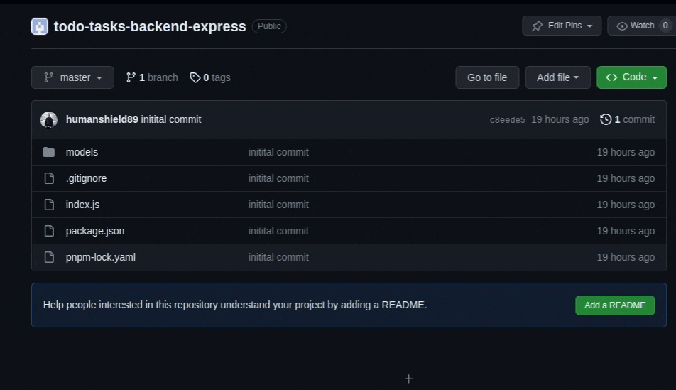
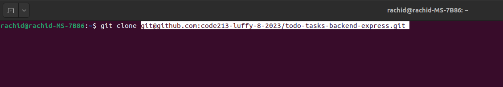
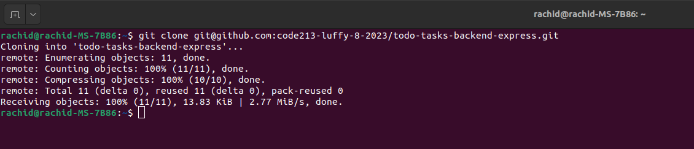

# Cloning a git repository

## Cloning a repository

1. Visit the repository page on GitHub and copy the link of the repo.

2. On Your computer open `terminal` or `cmd` or `powershell` and navigate to the folder where you want to clone the repo.

3. Type `git clone` and paste the link you copied from GitHub.

4. Press enter, the repo will be cloned to your computer.

5. You can see the cloned repo in your folder now. open it in `VS Code` or any other editor.

