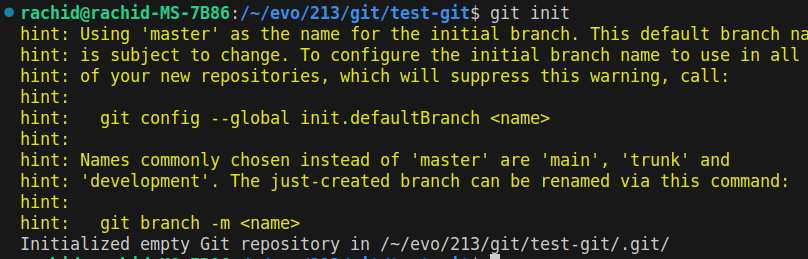
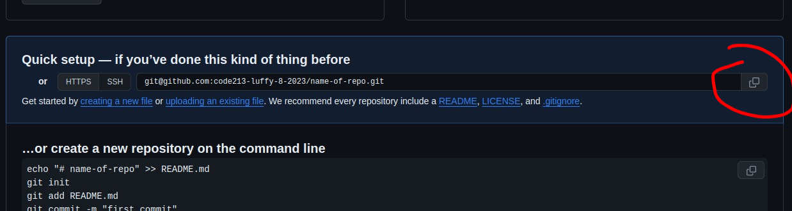

# How to create a git repo

1. Initialize a git repo in the folder you want to track

```bash
git init
```



2. Add the files you want to track

This will add all the files in the current folder
```bash
git add .
```

If you want to add only a specific file, you can do it like this
```bash
git add <file-name>
```

*The command should return nothing if it was successful.*

3. Commit the changes

If you are happy with the changes you made, you can commit them with the following command
```bash
git commit -m "Commit message"
```

4. Add a remote repository

4.1. Create a new repository on GitHub


4.2. Copy the remote repository URL



4.3. Add the remote repository URL to your local repository

```bash
git remote add origin <remote-repository-url-you-just-copied>
```

5. Push the changes to the remote repository

```bash
git push -u origin master
```

6. Check the remote repository by refreshing the page on GitHub